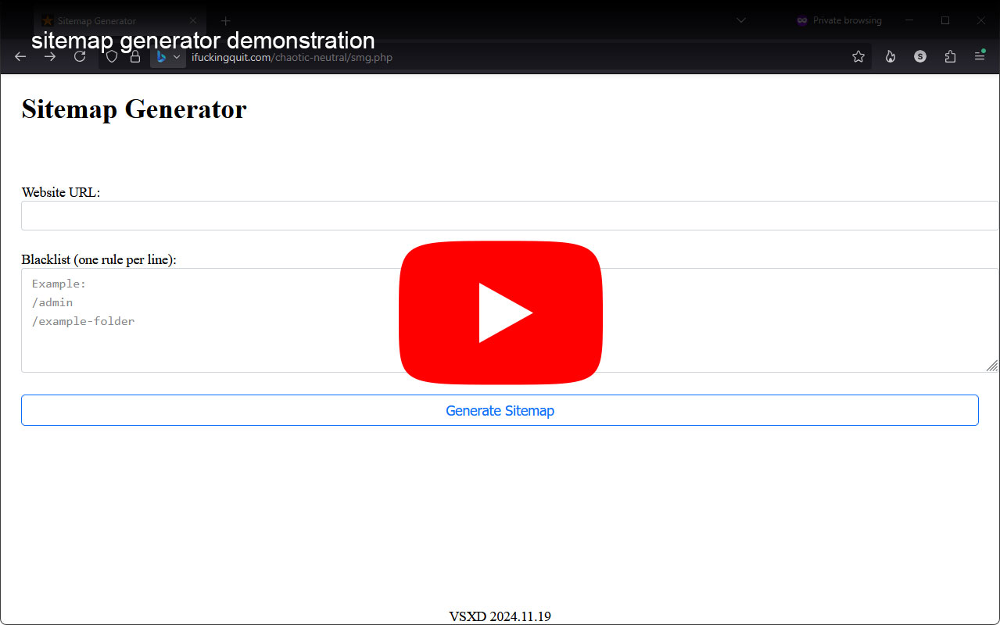

# smg
php sitemap.xml generator

i let chatgpt do the heavy lifting on the PHP code, use at your own risk.

enter any website address to crawl and generate a sitemap.xml file, file saved in same dir as smg.php file.

hardcoded to skip links like emails, tel, and external links.

textarea to add custom paths to blacklist if desired but not tested.

tested PHP versions 8.1.0 and 7.0.33... works on my machines ;)

## demonstration video

## step 1

## results

## xml file with style

